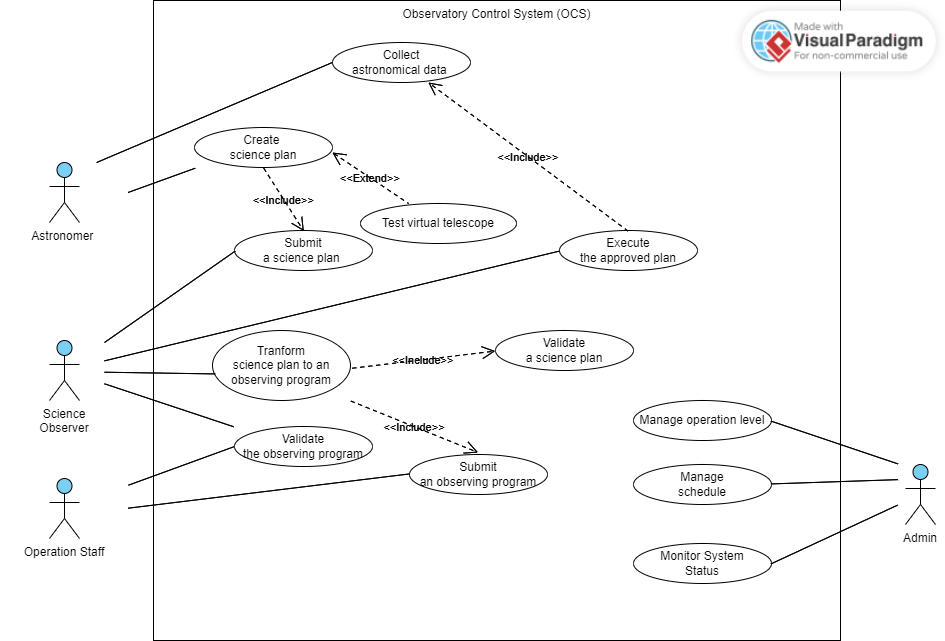
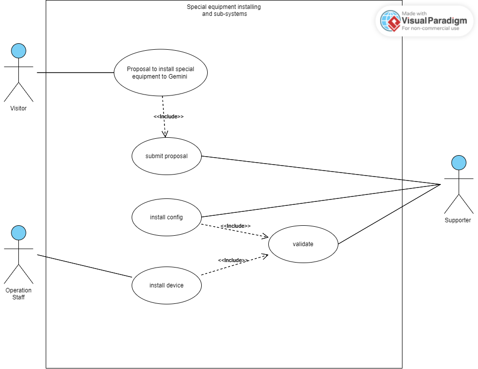
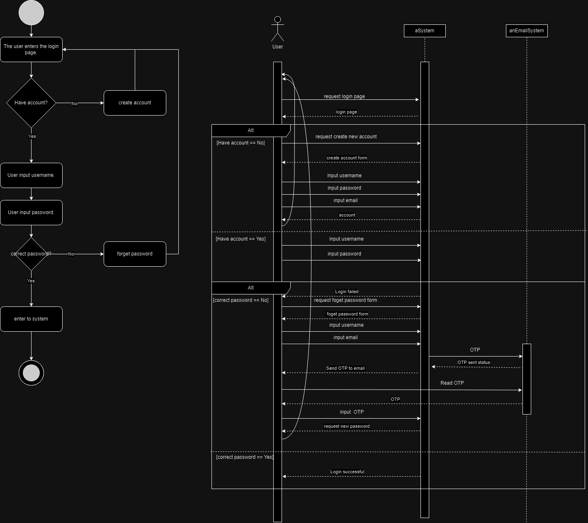
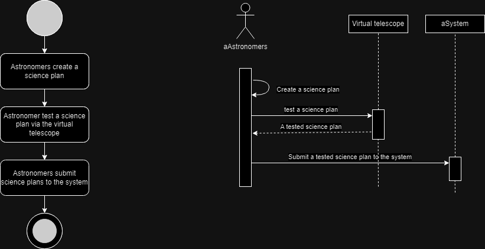
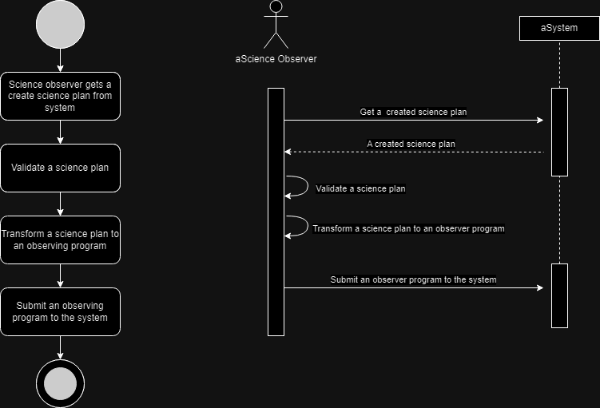
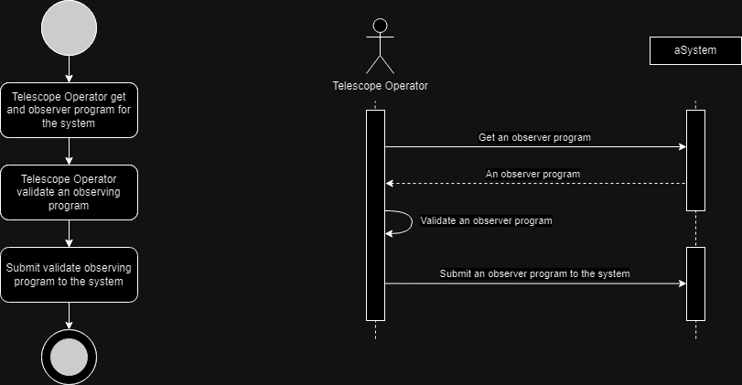
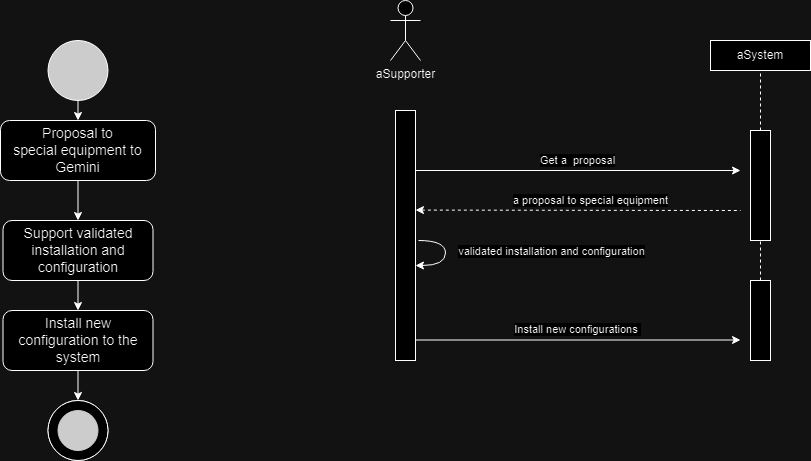

# ITDS361 Gemini Project

# Observatory Control System (OCS)
# Table of Contents
- [Requirements](#requirements-functional-and-non-functional-of-the-gemini-project)
- [Use Case Diagram](#use-case-diagram)
- [Use Case Description](#gemini-uc-description)
- [Class Diagram](#class-diagram)
- [Activity and Sequence Diagram](#activity-diagram-and-sequence-diagrams)

# Requirements (functional and non-functional) of the Gemini project
## Functional requirements

**Admin** ควบคุม high level function
-	กำหนด user management
-	กำหนด Operation level
-	บริหารจัดการ observation schedule 
-	กำหนด Shutdown time
-	กำหนดเวลา Maintenance 
-	System diagnosis
-	System status

**Astronomer** กลุ่มผู้ใช้ภายนอกที่จะเข้ามาใช้กล้องโทรทัศน์
-	สร้าง science plan ระบุข้อมูลการใช้กล้องโทรทัศน์ 
-	ทดสอบ science plan โดยการส่งข้อมูลผ่าน API (Virtual telescope)
-	Submit science plan
-	สามารถเข้ามาเก็บข้อมูลได้ เช่น ถ่ายภาพ ณ เวลานั้นๆ
-	Access live view

**Telescope operator** ผู้ดูแลกล้องโทรทัศน์
-	เข้าใช้งานผ่าน command line OCS (provide interface)
-	สร้าง Validate observing program
-	ติดตั้ง physical unit ตามที่ astronomer ขอมา

**Science Observer** ผู้ใช้ภายใน
-	Validate science plan เอามาดูและทดสอบว่าสามารถใช้ได้จริงหรือไหม
-	สร้าง observing program เพิ่มข้อมูลทางเทคนิค (เลนส์ องศา)
-	สามารถส่งobserving program ที่สร้างไปให้ Telescope operator ตรวจสอบได้
-	Execute science plan
-	เก็บ astronomical data (images)
-	ตรวจสอบความถูกต้องของ astronomical data (images)
-	สารมารถ controll Telescope ผ่าน OCS

**Support** 
-	ติดตั้ง extension ให้ OCS
-	ติดตั้ง components ใหม่ให้กับ system

## Non-functional requirements

 
**Software Requirements**
-	มีการกำหนดเวลา timeout ประมาณ 500 มิลลิวินาที
-	คำสั่งที่ใช้ Handshaking ระหว่าง IOCs ควรเกิดขึ้นในช่วง 100-200 มิลลิวินาที
-	สามารถทำ Transactions ได้ 100 Transactions ต่อ วินาที

**Perfomance & Reliability**

Capacity
-	มีความจุมากเพียงพอที่ทำให้ผู้ใช้เข้ามาได้พร้อมกันหลายคนโดยไม่เป็นปัญหา

Response Time
-	ทุกคำสั่งต้องได้รับการยอมรับหรือปฎิเสธภายใน 2 วินาที
-	การอัพเดตการแสดงสถานะข้อมูลจะต้องอยู่ภายใน 4 วินาทีที่สถานีท้องถิ่น
-	คำร้องขอสถานะของข้อมูลของระบบสำรองต้องถูกตอบกลับภายใน 5 วินาที 

Availability
-	software ทั้งหมดควรจะมีการเก็บ log
-	หากเกิดความผิดพลาดที่ hardware ต้องทำการรีเซ็ตระบบ

User Interfaces(UI)
- มีรูปแบบ user interface เพียง 1 แบบ
- ใช้เครื่องมือแบบเดียวกันทั้งโปรเจก
- มี network transparent ซึ่งทำให้สามารถถูกเรียกใช้งานที่ไหนก็ได้

# Use Case Diagram

# Observatory Control System (OCS)

- Create science plan เป็น use case ที่ Astronomer ทำการสร้าง science plan 
- Test virtual telescope เป็น use case ที่เอา science plan จากขั้นตอนที่แล้วมาทดสอบว่าใช้งานได้จริงหรือไม่
- Submit a science plan เป็น use case ที่ส่ง science plan ที่ทำการตรวจเช็คแล้วให้ Science Observer
- Tranform science plan to an observing program เป็น use case ที่ Science Observer เปลี่ยน science plan ให้เป็น observing program 
- Validate a science plan เป็น use case ที่ทำการยืนยัน science plan
- Submit an observing program เป็น use case ที่ทำการส่ง observing program
- Validate the observing program เป็น use case ที่ให้ Science Observer กับ Operation Staff ทำการยืนยัน observing program
- Execute the approved plan เป็น use case ที่ Science Observer ดำเนินการตาม science plan ที่ได้รับมา
- Collect astronomical data เป็น use case ที่ Astronomer จะทำการเก็บข้อมูลที่ได้จากการดำเนินการของ Science Observer
- Manage operation level เป็น use case ที่ให้ Admin บริหารจัดการการดำเนินงานภายในระบบ
- Manage schedule เป็น use case ที่ให้ Admin บริหารจัดการกำหนดการ
- Monitor System Status เป็น use case ที่ให้ Admin ดูแลการทำงานของระบบให้ระบบยังสามารถทำงานได้อย่างเป็นปกติ

# Special equipment installing and sub-systems  

- Proposal to install special equipment to Gemini เป็น use case ที่ Visitor เสนอให้ติดตั้งอุปกรณ์พิเศษ
- Submit proposal คือ use case ที่ทำการส่งข้อเสนอไปให้ Supporter 
- Validate คือ use case ที่ Supporter ทำการยืนยันข้อเสนอที่ส่งมา
- Install config คือ use case ที่ Supporter ทำการติดตั้ง config ลงระบบ
- Install device คือ use case ที่ Operation Staff ทำการติดตั้งอุปกรณ์พิเศษ

# Gemini UC description

# Case 1
<table>
        <tr>
            <th>Use Case Name</th>
            <td>Login to the system</td>
        </tr>
        <tr>
            <th>ID</th>
            <td>1</td>
        </tr>
        <tr>
            <th>Importance Level</th>
            <td>High</td>
        </tr>
        <tr>
            <th>Primary Actor</th>
            <td>User</td>
        </tr>
        <tr>
            <th>Use Case Type</th>
            <td>Detail, Essential</td>
        </tr>
        <tr>
            <th>Stakeholders and Interests</th>
            <td>User - wants to login to the system.</td>
        </tr>
        <tr>
            <th>Brief Description</th>
            <td>The user needs to login before using the Gemini system.</td>
        </tr>
        <tr>
            <th>Trigger</th>
            <td>The user wants to use the Gemini system.</td>
        </tr>
        <tr>
            <th>Type</th>
            <td>external</td>
        </tr>
        <tr>
            <th>Relationships</th>
            <td>Association: User</td>
        </tr>
        <tr>
            <th>Normal Flow of Events</th>
            <td>
                <ol>
                    <li>The user enters the login page.</li>
                    <li>The user has an account in the Gemini system.
                        <ol >
                            <li>If the user does not have an account. 
                                
The S-1 : create a new account subflow is performed.

                            </li>
                        </ol>
                    </li>
                    <li>User input username.</li>
                    <li>User input password.</li>
                    <li>If User inputs wrong password
                        
The S-2 : forget password subflow is performed.

                    </li>
                    <li>User enter to system</li>
                </ol>
            </td>
        </tr>
        <tr>
            <th>Subflows</th>
            <td>
                
The S-1 : create a new account

                <ol>
                    <li>User input username.</li>
                    <li>User input username.</li>
                    <li>User input email</li>
                </ol>
                
The S-2 : forget password

                <ol>
                    <li>User input username.</li>
                    <li>User input email</li>
                    <li>User verify account by email</li>
                    <li>User set new password</li>
                </ol>
            </td>
        </tr>
        <tr>
            <th>Alternate/Exceptional Flow</th>
            <td></td>
        </tr>
    </table> 

# Case 2
<table>
        <tr>
            <th>Use Case Name</th>
            <td>Submit a Science Plan</td>
        </tr>
        <tr>
            <th>ID</th>
            <td>2</td>
        </tr>
        <tr>
            <th>Importance Level</th>
            <td>High</td>
        </tr>
        <tr>
            <th>Primary Actor</th>
            <td>Astronomer</td>
        </tr>
        <tr>
            <th>Use Case Type</th>
            <td>Detail, Essential</td>
        </tr>
        <tr>
            <th>Stakeholders and Interests</th>
            <td>Astronomer - wants to submit their science plan</td>
        </tr>
        <tr>
            <th>Brief Description</th>
            <td>This use case describes an astronomer who wants to submit their science plan</td>
        </tr>
        <tr>
            <th>Trigger</th>
            <td>The astronomer wants to submit a science plan</td>
        </tr>
        <tr>
            <th>Type</th>
            <td>External</td>
        </tr>
        <tr>
            <th>Relationships</th>
            <td>Association: Astronomer</td>
        </tr>
        <tr>
            <th>Normal Flow of Events</th>
            <td>
                <ol>
                    <li>Astronomers create a science plan.</li>
                    <li>Astronomers test a science plan via the virtual telescope and interactive observing mode.</li>
                    <li>Astronomers submit science plans to the system.</li>
                </ol>
            </td>
        </tr>
        <tr>
            <th>Subflows</th>
            <td></td>
        </tr>
        <tr>
            <th>Alternate/Exceptional Flow</th>
            <td>Science plan has not been tested and the interactive observation</td>
        </tr>
    </table> 

# Case 3
<table>
        <tr>
            <th>Use Case Name</th>
            <td>Create an Observing Program</td>
        </tr>
        <tr>
            <th>ID</th>
            <td>3</td>
        </tr>
        <tr>
            <th>Importance Level</th>
            <td>High</td>
        </tr>
        <tr>
            <th>Primary Actor</th>
            <td>Science Observer</td>
        </tr>
        <tr>
            <th>Use Case Type</th>
            <td>Detail, Essential</td>
        </tr>
        <tr>
            <th>Stakeholders and Interests</th>
            <td>Astronomer Telescope Operator</td>
        </tr>
        <tr>
            <th>Brief Description</th>
            <td>This use case describes how a science observer transforms a science plan to an observing program</td>
        </tr>
        <tr>
            <th>Trigger</th>
            <td>Science Observer received a created science plan from Astronomer</td>
        </tr>
        <tr>
            <th>Type</th>
            <td></td>
        </tr>
        <tr>
            <th>Relationships</th>
            <td>Association: Science Observer</td>
        </tr>
        <tr>
            <th>Normal Flow of Events</th>
            <td>
                <ol>
                    <li>The science observer gets a created science plan from the system.</li>
                    <li>Validate a science plan.</li>
                    <li>Transform a science plan to an observing program.</li>
                    <li>Submit an observing program to the system.</li>
                </ol>
            </td>
        </tr>
        <tr>
            <th>Subflows</th>
            <td></td>
        </tr>
        <tr>
            <th>Alternate/Exceptional Flow</th>
            <td></td>
        </tr>
    </table> 

# Case 4
<table>
        <tr>
            <th>Use Case Name</th>
            <td>Validate an Observing Program</td>
        </tr>
        <tr>
            <th>ID</th>
            <td>4</td>
        </tr>
        <tr>
            <th>Importance Level</th>
            <td>High</td>
        </tr>
        <tr>
            <th>Primary Actor</th>
            <td>Telescope Operator</td>
        </tr>
        <tr>
            <th>Use Case Type</th>
            <td>Detail, Essential</td>
        </tr>
        <tr>
            <th>Stakeholders and Interests</th>
            <td>Telescope Operator - wants to validate an observing program</td>
        </tr>
        <tr>
            <th>Brief Description</th>
            <td>This use case describes how a telescope operator validates an observing program</td>
        </tr>
        <tr>
            <th>Trigger</th>
            <td>Telescope Operator wants to validate an observing program</td>
        </tr>
        <tr>
            <th>Type</th>
            <td>External</td>
        </tr>
        <tr>
            <th>Relationships</th>
            <td>Association: Telescope Operator</td>
        </tr>
        <tr>
            <th>Normal Flow of Events</th>
            <td>
                <ol>
                    <li>Telescope Operator gets an observing program for the system.</li>
                    <li>Telescope Operator validates an observing program.</li>
                    <li>Submit an observing program to the system.</li>
                </ol>
            </td>
        </tr>
        <tr>
            <th>Subflows</th>
            <td></td>
        </tr>
        <tr>
            <th>Alternate/Exceptional Flow</th>
            <td></td>
        </tr>
    </table> 

# Case 5
  <table>
        <tr>
            <th>Use Case Name</th>
            <td>Install new configurations to the system</td>
        </tr>
        <tr>
            <th>ID</th>
            <td>5</td>
        </tr>
        <tr>
            <th>Importance Level</th>
            <td>High</td>
        </tr>
        <tr>
            <th>Primary Actor</th>
            <td>Supporter</td>
        </tr>
        <tr>
            <th>Use Case Type</th>
            <td>Detail, Essential</td>
        </tr>
        <tr>
            <th>Stakeholders and Interests</th>
            <td>Supporter – wants to install new configurations to the system</td>
        </tr>
        <tr>
            <th>Brief Description</th>
            <td>This use case describes the process of installation and configuration with support</td>
        </tr>
        <tr>
            <th>Trigger</th>
            <td>New or updated configurations</td>
        </tr>
        <tr>
            <th>Type</th>
            <td>Internal</td>
        </tr>
        <tr>
            <th>Relationships</th>
            <td>Association: Supporter</td>
        </tr>
        <tr>
            <th>Normal Flow of Events</th>
            <td>
                <ol>
                    <li>Proposal to special equipment to Gemini.</li>
                    <li>Support validated installation and configuration.</li>
                    <li>Install new configurations to the system.</li>
                </ol>
            </td>
        </tr>
        <tr>
            <th>Subflows</th>
            <td></td>
        </tr>
        <tr>
            <th>Alternate/Exceptional Flow</th>
            <td>The installation is unable to be installed; the installation is rejected</td>
        </tr>
    </table> 

# Class Diagram

# Activity Diagram and Sequence diagrams

# Case 1 Login to the system

# Case 2 Submit a Science Plan

# Case 3 Create an observing program

# Case 4 Validate an Observing Program

# Case 5 Install new configurations to the system

# Contributors
<pre>
Yuttapichai  Promnok
Ravisara  Wilaipong
Thanakrit Siripanjanon
Patthaweekan  Panplab
Papavarin  Khamim
Sirada  Namboot 
</pre>
