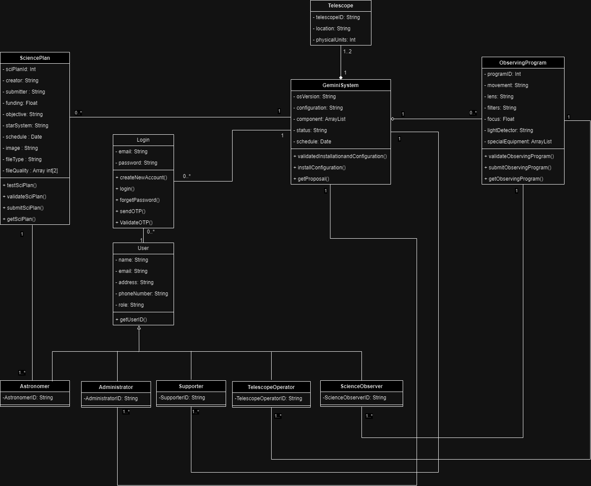
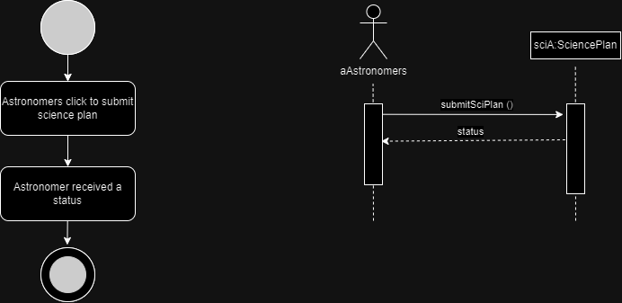
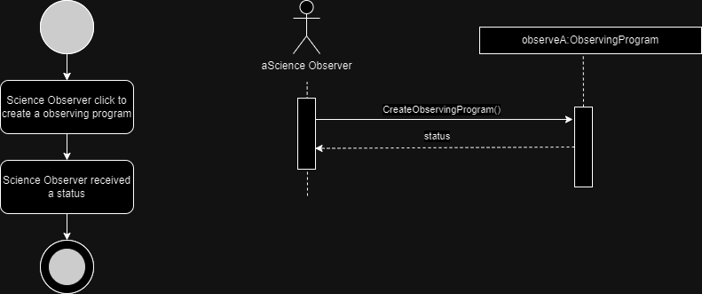
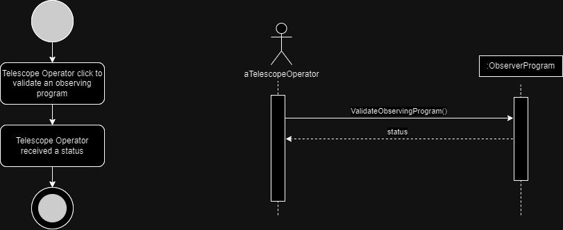

# Revision Submission
# Table of Contents
- [Class Diagram](#class-diagram)
- [Case 2 Submit a Science Plan](#case-2)
- [Case 3 Create an Observing Program](#case-3)
- [Case 4 Validate an Observing Program](#case-4)
# Class Diagram

# Case 2
<table>
        <tr>
            <th>Use Case Name</th>
            <td>Submit a Science Plan</td>
        </tr>
        <tr>
            <th>ID</th>
            <td>2</td>
        </tr>
        <tr>
            <th>Importance Level</th>
            <td>High</td>
        </tr>
        <tr>
            <th>Primary Actor</th>
            <td>Astronomer</td>
        </tr>
        <tr>
            <th>Use Case Type</th>
            <td>Detail, Essential</td>
        </tr>
        <tr>
            <th>Stakeholders and Interests</th>
            <td>Astronomer - wants to submit their science plan</td>
        </tr>
        <tr>
            <th>Brief Description</th>
            <td>This use case describes an astronomer who wants to submit their science plan</td>
        </tr>
        <tr>
            <th>Trigger</th>
            <td>The astronomer wants to submit a science plan</td>
        </tr>
        <tr>
            <th>Type</th>
            <td>External</td>
        </tr>
        <tr>
            <th>Relationships</th>
            <td>Association: Astronomer</td>
        </tr>
        <tr>
            <th>Normal Flow of Events</th>
            <td>
                <ol>
                    <li>Astronomers click to submit science plan.</li>
                    <li>Astronomer received a status</li>
                </ol>
            </td>
        </tr>
        <tr>
            <th>Subflows</th>
            <td></td>
        </tr>
        <tr>
            <th>Alternate/Exceptional Flow</th>
            <td>Science plan has not been tested and the interactive observation</td>
        </tr>
    </table>

# Case 3
<table>
        <tr>
            <th>Use Case Name</th>
            <td>Create an Observing Program</td>
        </tr>
        <tr>
            <th>ID</th>
            <td>3</td>
        </tr>
        <tr>
            <th>Importance Level</th>
            <td>High</td>
        </tr>
        <tr>
            <th>Primary Actor</th>
            <td>Science Observer</td>
        </tr>
        <tr>
            <th>Use Case Type</th>
            <td>Detail, Essential</td>
        </tr>
        <tr>
            <th>Stakeholders and Interests</th>
            <td>Science Observer: wants to create observing program</td>
        </tr>
        <tr>
            <th>Brief Description</th>
            <td>This use case describes how a science observer transforms a science plan to an observing program</td>
        </tr>
        <tr>
            <th>Trigger</th>
            <td>Science Observer received a created science plan from Astronomer</td>
        </tr>
        <tr>
            <th>Type</th>
            <td></td>
        </tr>
        <tr>
            <th>Relationships</th>
            <td>Association: Science Observer</td>
        </tr>
        <tr>
            <th>Normal Flow of Events</th>
            <td>
                <ol>
                    <li>Science Observer click to create a observing program.</li>
                    <li>Science Observer received a status.</li>
                </ol>
            </td>
        </tr>
        <tr>
            <th>Subflows</th>
            <td></td>
        </tr>
        <tr>
            <th>Alternate/Exceptional Flow</th>
            <td></td>
        </tr>
    </table>

# Case 4
<table>
        <tr>
            <th>Use Case Name</th>
            <td>Validate an Observing Program</td>
        </tr>
        <tr>
            <th>ID</th>
            <td>4</td>
        </tr>
        <tr>
            <th>Importance Level</th>
            <td>HIGH</td>
        </tr>
        <tr>
            <th>Primary Actor</th>
            <td>Telescope Operator</td>
        </tr>
        <tr>
            <th>Use Case Type</th>
            <td>Detail, Essential</td>
        </tr>
        <tr>
            <th>Stakeholders and Interests</th>
            <td>Telescope Operator: wants to validate an observing program</td>
        </tr>
        <tr>
            <th>Brief Description</th>
            <td>This use case describes how a telescope operator validates an observing program</td>
        </tr>
        <tr>
            <th>Trigger</th>
            <td>Telescope Operator wants to validate an observing program</td>
        </tr>
        <tr>
            <th>Type</th>
            <td>External</td>
        </tr>
        <tr>
            <th>Relationships</th>
            <td>Association: Telescope Operator</td>
        </tr>
        <tr>
            <th>Normal Flow of Events</th>
            <td>
                <ol>
                    <li>TTelescope Operator click to validate an observing program.</li>
                    <li>Telescope Operator received a status.</li>
                </ol>
            </td>
        </tr>
        <tr>
            <th>Subflows</th>
            <td></td>
        </tr>
        <tr>
            <th>Alternate/Exceptional Flow</th>
            <td></td>
        </tr>
    </table>

# Contributors
<pre>
Yuttapichai  Promnok
Ravisara  Wilaipong
Thanakrit Siripanjanon
Patthaweekan  Panplab
Papavarin  Khamim
Sirada  Namboot 
</pre>