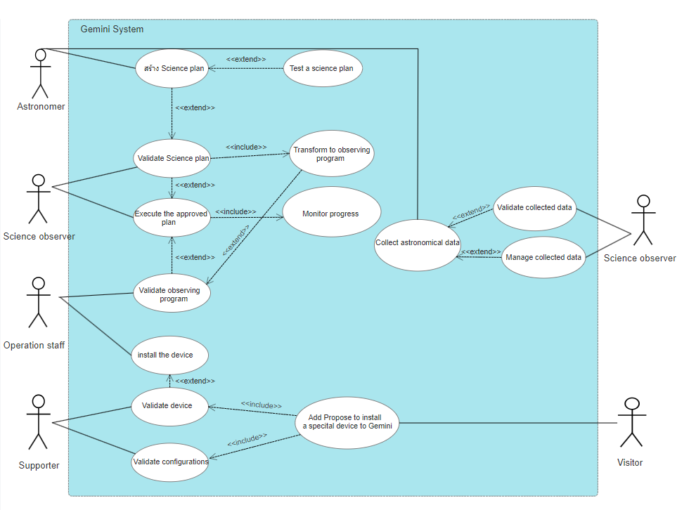

# Use Cases Diagram

# Use Cases Description

สร้าง Science plan
- Use Case ที่ Astronomer ทำการสร้าง Science plan

Test a Science plan
- Use Case ที่ทดสอบ science plan โดย virtual telescope และ interactive observing mode

Validate Science plan
- Use Case ที่ตรวจสอบความถูกต้องของ Science plan โดย Science Observer

Transform to observing program
- Use Case ที่ Science observer แปลง science plan ให้เป็น observing program

Validate observing program
- Use Case ที่ตรวจสอบความถูกต้องของ observing program หลังจากการ Transform โดย Operation Staff

Execute the approved program
- Use Case ที่เป็นกระบวนการดำเนินการกับ observing program โดยผ่าน Science Observer

Monitor progress
- Monitor ความคืบหน้าของ science plan execution หลังจาก Execute the approved program

Collect astronomical data
- Use Case ที่เก็บข้อมูลที่ต้องการจาก Science plan เพื่อทำการส่งต่อให้ Astronomer

Validate collected data
- Use Case ที่ตรวจสอบความถูกต้องของข้อมูลที่เก็บจากการ Execute the approved program และ Monitor progress โดย Science Observer

Manage collected data
- Use Case ที่บริหารข้อมูลที่เก็บจากการ Execute the approved program และ Monitor progress โดย Science Observer

Install device
- Use Case ข้อมูลที่ Operation Staff ดำเนินการติดตั้ง device ให้กับ Gemini

Validate device
- Use Case ที่ตรวจสอบความถูกต้องของ device ที่จะติดตั้งกับ Gemini โดย Supporter

Validate configurations
- Use Case ที่ตรวจสอบความถูกต้องของ configurations และติดตั้ง โดย Supporter

Add Propose to install a special device to Gemini
- Use Case ที่เก็บข้อมูลที่ Visitor เสนอ special device ที่ต้องการติดตั้งให้กับ Gemini
